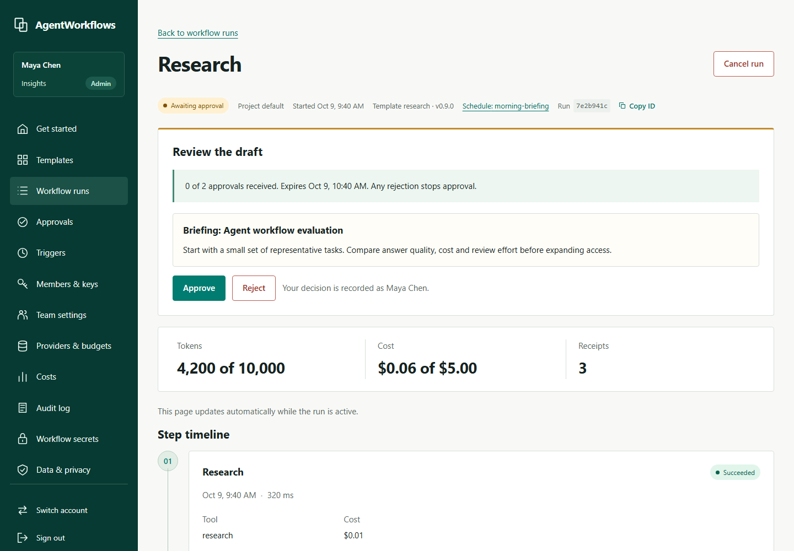
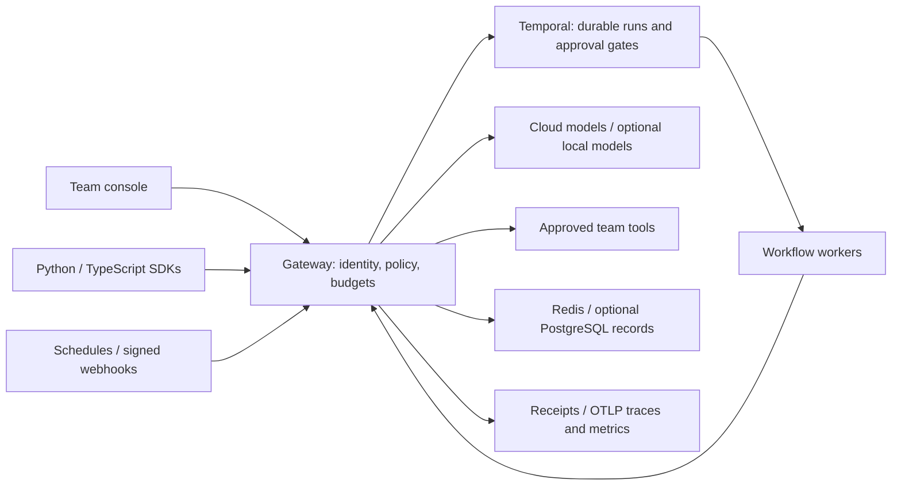

# AgentWorkflows

**Put your team's AI agents to work—with approvals, spend limits, and an audit trail in one platform.**

[](https://github.com/RamazanKara/agentworkflows/actions/workflows/ci.yml)
[](https://ramazankara.github.io/agentworkflows/)
[](LICENSE)

Agent scripts are easy to start and hard to operate as a team. Keys spread across laptops.
Nobody owns the approval step. Retries multiply the bill. When a result is wrong, its
prompt, tool call, cost, and reviewer are in different systems.

AgentWorkflows brings a cloud model gateway, Temporal workflows, and a team console
together. Give each workflow a budget, pause for human review, and follow every governed
step from request to receipt. Connect OpenAI, Anthropic, Azure OpenAI, Bedrock, or Vertex
Gemini. Keep provider keys on the server and workflow code in Python or TypeScript.



*1440 px console capture with consistent test data. [Verification record](docs/release-verification.md).*

## Built for teams shipping agents

- **Developers:** turn a working script into a durable job without writing an approval app, usage ledger, and scheduler.
- **Team leads:** review drafts before publication and see what each run costs.
- **Platform engineers:** provide shared model access with scoped roles, budgets, and retained evidence.

The platform is self-hosted and built for cloud providers; local models and GPUs are optional. This checkout targets
**1.0.0-rc.4 (unreleased)**. Build from source to evaluate it. Package versions remain
0.9.0; no hosted service or rc.4 release artifacts are published.

## 60-second console quickstart

Prerequisite: clone this repository and start its local stack with Docker Compose:

```sh
git clone https://github.com/RamazanKara/agentworkflows.git
cd agentworkflows
docker compose -f deploy/compose/compose.yaml up --build -d --wait workflow-worker
```

Image builds and downloads are setup time, outside the console walkthrough.
No cloud key, GPU, or Kubernetes cluster is needed. Once the stack is ready:

1. Open [the console](http://127.0.0.1:8080/console/) and sign in with `local-development-only`.
2. In **Get started**, check readiness and start the sample Research workflow.
3. Read the draft, approve it, and inspect the completed run's timeline and receipts.

The demo uses simulated models and local tools: no provider is billed and nothing is
published externally. For the scripted approval and audit check, run
`python scripts/first-approved-run.py compose`. See the [full quickstart](docs/quickstart.md)
for real-provider setup and troubleshooting. The [verification record](docs/release-verification.md)
separates native checks from container acceptance. The 60-second walkthrough excludes setup;
it is not a cold-install benchmark.

## What your team gets

| Capability | Outcome |
| --- | --- |
| Human approvals | Pause before an action; require 1–10 distinct reviewers and set expiry from 60 seconds to 7 days. |
| Teams, roles, and SSO | Builders start work, approvers review it, viewers inspect it. Map company OIDC groups to roles and manage expiring API keys. |
| Budgets and spend limits | Cap each run's tokens and dollars; set monthly team/project limits and see spend before expanding access. |
| Tamper-evident audit | Link model calls, tool actions, approvals, and operations to verifiable receipts. Export the retained record. |
| Versioned templates | Choose from 9 workflows, install a reviewed version, fill in its form, and adapt the code when needed. |
| Triggers | Start jobs on a schedule or signed webhook; trace each run to its trigger. |
| Observability | Inspect step cost, latency, input/output, errors, and receipts together; choose Slack/email/webhook alerts and export OpenTelemetry traces and metrics. |
| Python and TypeScript SDKs | Use governed activities and durable approval gates from code; call the same team APIs as the console. |
| Compose and Helm | Evaluate with one Compose command; deploy the gateway, worker, and Temporal together on Kubernetes. |

## Compared with building it yourself

AgentWorkflows packages the team application around model routing and Temporal execution.
It does not embed LiteLLM. Build your own integration when you need full control over the
application or already maintain the surrounding product.

| Decision | AgentWorkflows | Your own gateway + Temporal application |
| --- | --- | --- |
| Time to first approved run | 3 console steps after setup; the scripted trial checks completion and audit verification within 300 seconds. | Depends on your existing application; no universal time estimate. |
| What you must build | Workflow logic, real data/tool integrations, and deployment configuration. | Those integrations plus approval screens, identity wiring, per-run accounting, audit linkage, and operations UX. |
| What you get | One console and API for runs, review, access, spend, templates, triggers, and evidence. | The component capabilities you choose, with full control over the application. |
| What you operate | Gateway, workers, Temporal, Redis, storage, backups, and upgrades. | Your components and their integration. |
| Tradeoff | A narrower, opinionated product under release-candidate validation. | More implementation and maintenance; more freedom over provider coverage and UX. |

[Build-or-adopt decision guide](docs/decision-guide.md).

## Architecture



Temporal retains execution history in its own database. Redis handles live budgets and
sessions; gateway records can use PostgreSQL. [Architecture and request flow](docs/architecture.md).

## Security and privacy

Provider credentials stay on the gateway. Team/project authorization covers runs, keys,
settings, and exports. Browser sign-in uses HttpOnly sessions; OIDC uses PKCE. Workflow
secrets are encrypted with an operator-managed key. Content capture has its own retention.

Hash chains detect edits and internal gaps in retained receipts. Detecting tail truncation
or replacement requires external head anchors and restart links. Unreported actions cannot
be proven. Inputs and results also live in Temporal history; configure its retention,
provider retention, and backups separately.

[Security overview](docs/security-overview.md) · [Threat model](docs/threat-model.md) ·
[Data lifecycle](docs/team-lifecycle.md) · [Audit runbook](runbooks/audit-chain.md).
Report vulnerabilities through [SECURITY.md](SECURITY.md).

## Start here

| Next step | Guide |
| --- | --- |
| Run a workflow | [Quickstart](docs/quickstart.md) · [Template gallery](docs/templates.md) |
| Build your workflow | [Concepts](docs/concepts.md) · [SDK reference](docs/sdk-reference.md) |
| Deploy for a team | [Helm install](docs/install-kubernetes.md) · [Single-tenant reference](docs/single-tenant.md) · [Production checklist](docs/kubernetes-production-checklist.md) |
| Operate and recover | [Runbooks](runbooks/README.md) · [Release verification](docs/release-verification.md) |
| Track the product | [Roadmap](ROADMAP.md) · [Product gaps](docs/PRODUCT-GAPS.md) · [Changelog](CHANGELOG.md) |

[Full documentation](https://ramazankara.github.io/agentworkflows/).
Licensed under [Apache-2.0](LICENSE); attribution in [NOTICE](NOTICE).
